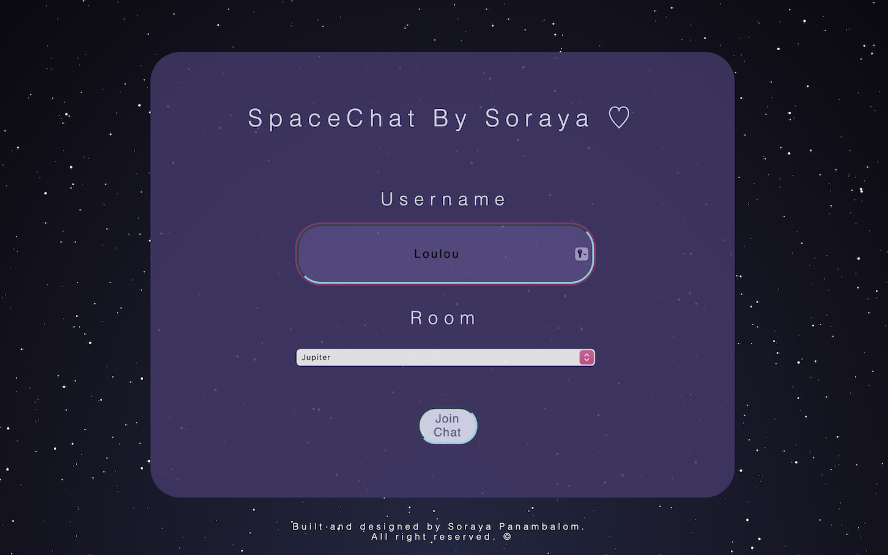
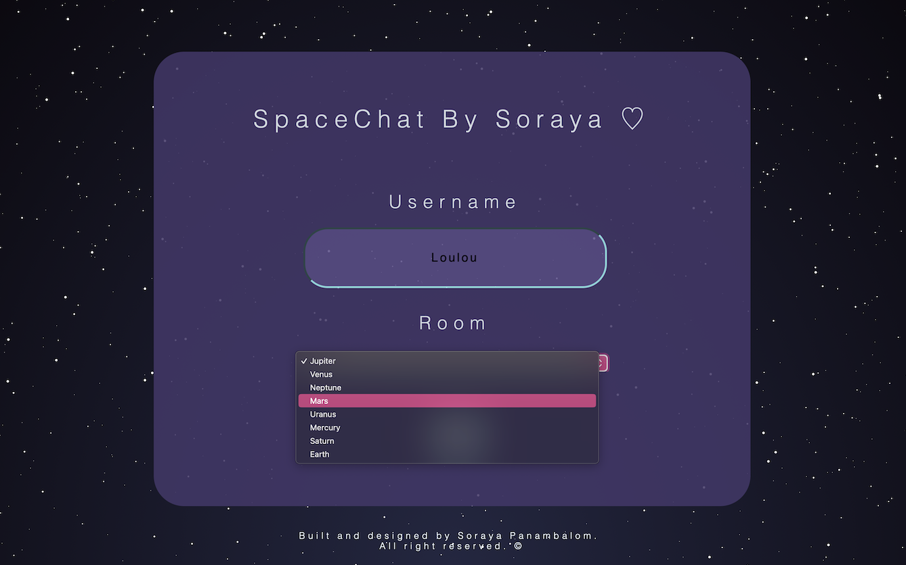
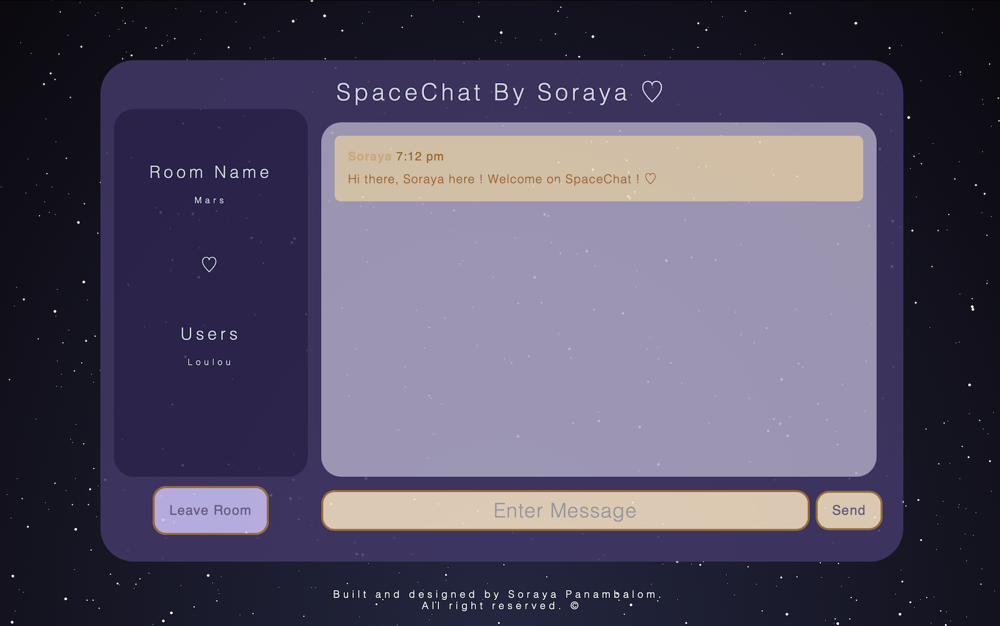
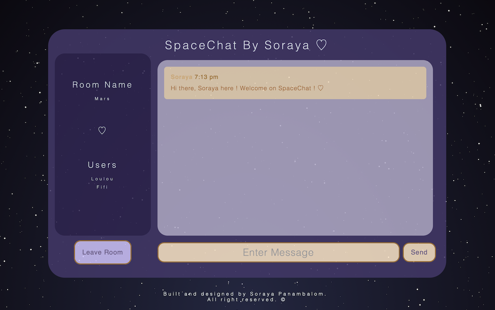
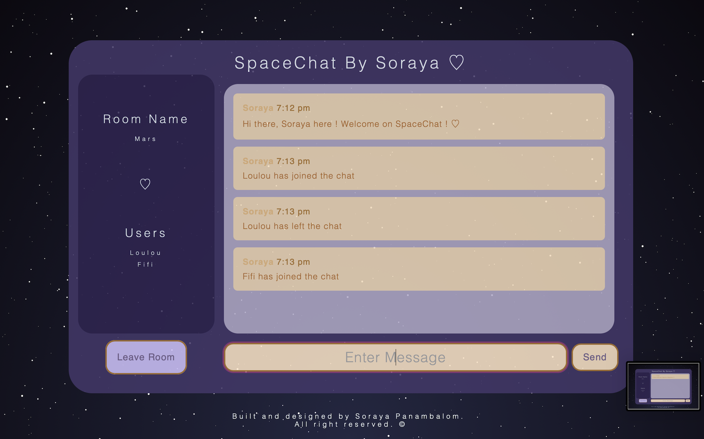
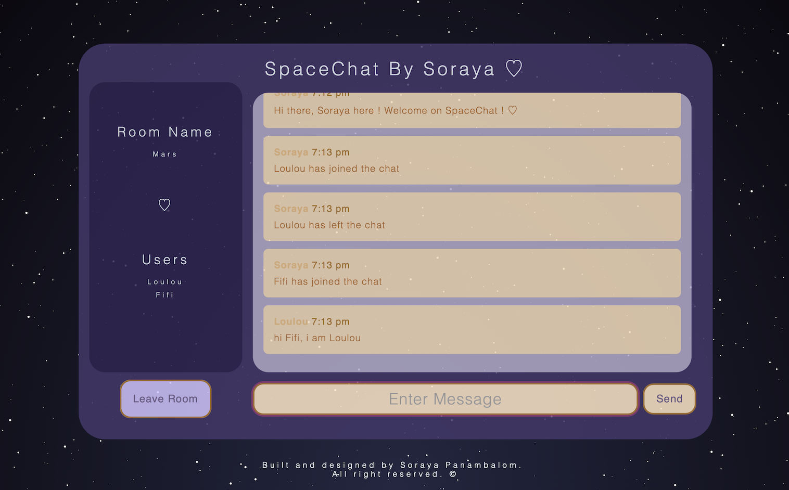
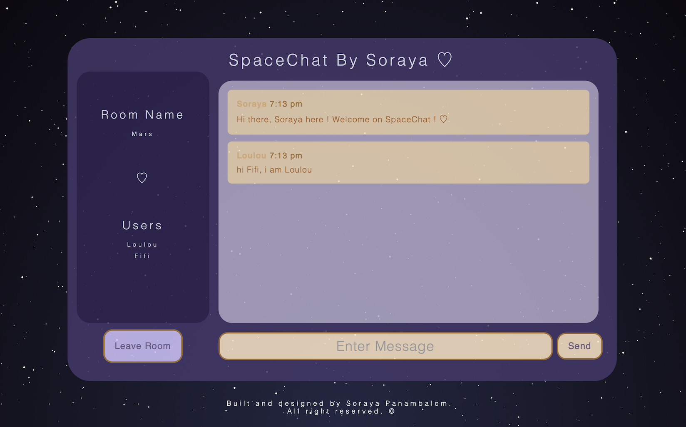

# SpaceChat

SpaceChat is a real-time chat web application that allows users to connect, join chat rooms and exchange messages in real-time.

## How to run 

In the main folder run in the terminal:

    npm run dev

Navigate to `http://localhost:3000`

- Soraya PANAMBALOM
